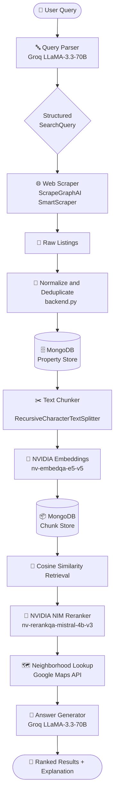
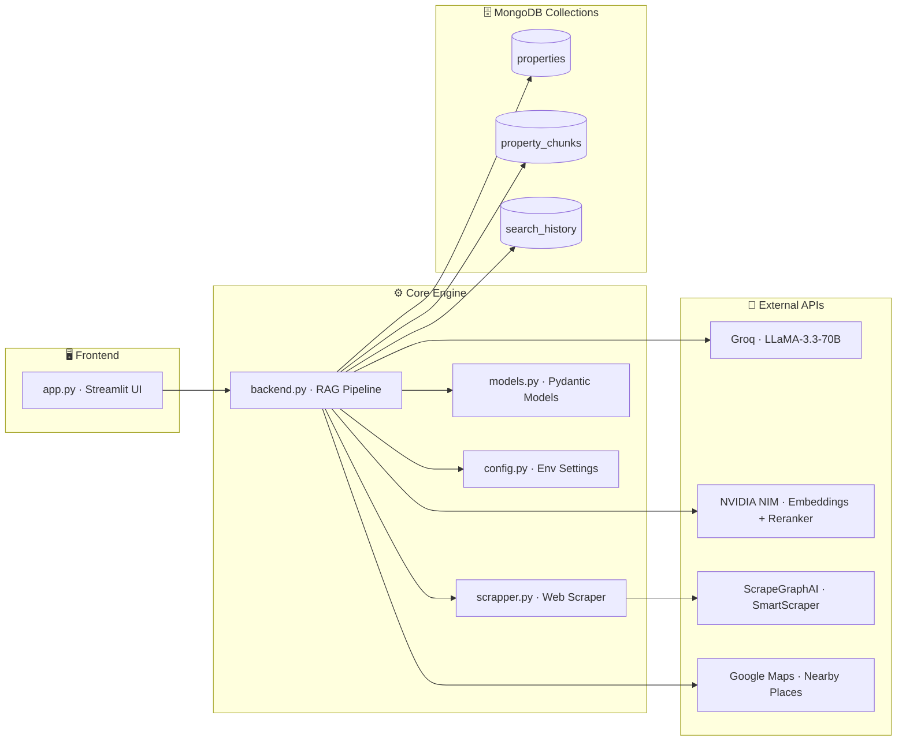
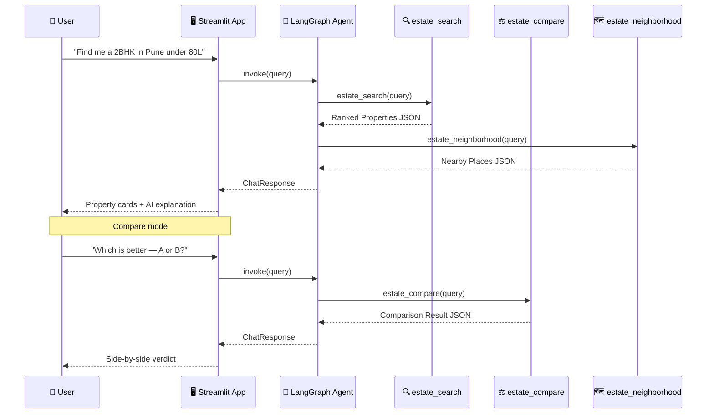

<div align="center">

# 🏠 EstateGPT

**Intelligent Real Estate Matchmaking Engine for India**

[](https://python.org)
[](https://streamlit.io)
[](https://langchain.com)
[](https://mongodb.com)
[](https://groq.com)
[](https://build.nvidia.com)
[](LICENSE)
[](https://github.com/tushar80rt/estate/stargazers)

> An agentic AI platform that **scrapes**, **embeds**, **reranks**, and **explains** real estate listings using a full RAG pipeline — all from a single natural-language query.

</div>

---

## ✨ What is EstateGPT?

EstateGPT is a **production-grade AI real-estate assistant** that turns a plain-English property request like:

> *"3 BHK flat in Bangalore under ₹1.2 Cr with metro access and a good school nearby"*

...into a **ranked, enriched, explainable shortlist** of matching properties — scraped live from India's top real-estate portals.

---

## 🎬 Features at a Glance

| Feature | Description |
|---|---|
| 🔍 **Natural Language Search** | Describe what you want in plain English |
| 🏆 **AI-Powered Ranking** | Properties ranked by NVIDIA NIM reranker |
| 🗺️ **Neighborhood Intelligence** | Nearby schools, hospitals, metro via Google Maps |
| ⚖️ **Property Comparison** | Side-by-side AI comparison with verdict |
| 💾 **Search History** | MongoDB-persisted history in the sidebar |
| 📊 **Investment Score** | Heuristic investment & travel suitability scores |
| 🔗 **Multi-Source Scraping** | Scrapes MagicBricks, 99acres & more |

---

## 🏗️ Architecture

### Full RAG Pipeline



---

### Project Module Map



---

### Agent Tool Sequence



---

## 🚀 Quick Start

### Prerequisites

| Tool | Minimum Version | Download |
|---|---|---|
| Python | 3.10+ | [python.org](https://python.org) |
| MongoDB | 6.0+ | [mongodb.com](https://mongodb.com/try/download/community) |
| Git | any | [git-scm.com](https://git-scm.com) |

---

### Step 1 — Clone the Repository

```bash
git clone https://github.com/tushar80rt/estate.git
cd estate
```

### Step 2 — Create a Virtual Environment

```bash
# Windows
python -m venv venv
venv\Scripts\activate

# macOS / Linux
python -m venv venv
source venv/bin/activate
```

### Step 3 — Install Dependencies

```bash
pip install -r requirements.txt
```

### Step 4 — Configure API Keys

Create a `.env` file in the project root:

```env
# ── LLM  (Required) ────────────────────────────────────────────────
GROQ_API_KEY=gsk_xxxxxxxxxxxxxxxxxxxxxxxxxxxx
GROQ_MODEL=llama-3.3-70b-versatile

# ── Web Scraping  (Required) ────────────────────────────────────────
SCRAPEGRAPH_API_KEY=sgai_xxxxxxxxxxxxxxxxxxxxxxxxxxxx

# ── NVIDIA NIM — Embeddings & Reranker  (Required) ─────────────────
NVIDIA_API_KEY=nvapi_xxxxxxxxxxxxxxxxxxxxxxxxxxxx

# ── MongoDB  (Required) ─────────────────────────────────────────────
MONGODB_URI=mongodb://localhost:27017
MONGODB_DB=estategpt
MONGODB_COLLECTION=properties
MONGODB_CHUNK_COLLECTION=property_chunks

# ── Google Maps  (Optional — for neighborhood intelligence) ─────────
GOOGLE_MAPS_API_KEY=AIzaxxxxxxxxxxxxxxxxxxxxxxxxxxxx
```

> **💡 Tip:** You can skip the `.env` file entirely and paste your **Groq** and **ScrapeGraph** keys directly in the Streamlit sidebar at runtime.

### Step 5 — Start MongoDB

```bash
# Windows (service)
net start MongoDB

# macOS / Linux
mongod --dbpath /data/db
```

### Step 6 — Launch the App

```bash
streamlit run app.py
```

Open **http://localhost:8501** in your browser 🎉

---

## 🔑 API Keys Reference

| Service | Used For | Free Tier | Get It |
|---|---|---|---|
| **Groq** | LLM inference (LLaMA-3.3-70B) | ✅ Yes | [console.groq.com](https://console.groq.com) |
| **ScrapeGraphAI** | AI-powered web scraping | ✅ Yes | [scrapegraphai.com](https://scrapegraphai.com) |
| **NVIDIA NIM** | Embeddings + Neural reranking | ✅ Free credits | [build.nvidia.com](https://build.nvidia.com) |
| **Google Maps** | Neighborhood places & distances | ✅ $200 credit/mo | [console.cloud.google.com](https://console.cloud.google.com) |

---

## 📁 Project Structure

```
estate/
│
├── app.py              # 🖥️  Streamlit UI — chat input, property cards, sidebar history
├── backend.py          # ⚙️  Core RAG engine — scrape → embed → rerank → answer
├── scrapper.py         # 🌐  ScrapeGraphAI SmartScraper integration
├── models.py           # 📐  All Pydantic v2 data models
├── config.py           # 🔧  Environment variables & constants
│
├── assets/
│   └── Groq.svg        # 🎨  Groq logo used in sidebar
│
├── requirements.txt    # 📦  Pinned Python dependencies
└── .env                # 🔒  Secret keys — NOT committed to Git
```

---

## 🧠 How It Works — 8-Step Pipeline

```mermaid
flowchart LR
    Q[/"📝 User types a
    property request"/]

    Q --> S1["1️⃣ PARSE
    Groq extracts city,
    beds, budget, amenities"]

    S1 --> S2["2️⃣ SCRAPE
    ScrapeGraphAI hits
    MagicBricks, 99acres"]

    S2 --> S3["3️⃣ STORE
    Normalized listings
    saved to MongoDB"]

    S3 --> S4["4️⃣ EMBED
    NVIDIA nv-embedqa-e5-v5
    vectorizes each chunk"]

    S4 --> S5["5️⃣ RETRIEVE
    Cosine similarity search
    over chunk embeddings"]

    S5 --> S6["6️⃣ RERANK
    NVIDIA NIM reranker
    scores top candidates"]

    S6 --> S7["7️⃣ ENRICH
    Google Maps finds
    nearby schools & metro"]

    S7 --> S8["8️⃣ ANSWER
    Groq LLaMA writes
    pros, cons & verdict"]

    S8 --> R[/"✅ Ranked property cards
    displayed to user"/]
```



---

## ⚙️ Configuration Reference

| Variable | Default | Required | Description |
|---|---|:---:|---|
| `GROQ_API_KEY` | — | ✅ | Groq API key for LLM inference |
| `GROQ_MODEL` | `llama-3.3-70b-versatile` | ❌ | Groq model identifier |
| `SCRAPEGRAPH_API_KEY` | — | ✅ | ScrapeGraphAI SmartScraper key |
| `NVIDIA_API_KEY` | — | ✅ | NVIDIA NIM key (embeddings + reranker) |
| `GOOGLE_MAPS_API_KEY` | — | ❌ | Google Maps Places API key |
| `MONGODB_URI` | `mongodb://localhost:27017` | ✅ | MongoDB connection string |
| `MONGODB_DB` | `estategpt` | ❌ | Target database name |
| `MONGODB_COLLECTION` | `properties` | ❌ | Property documents collection |
| `MONGODB_CHUNK_COLLECTION` | `property_chunks` | ❌ | RAG chunk embeddings collection |

---

## 🛠️ Tech Stack

| Layer | Technology | Version |
|---|---|---|
| **UI** | Streamlit | 1.59.1 |
| **LLM** | Groq — LLaMA-3.3-70B-Versatile | 1.5.0 |
| **Embeddings** | NVIDIA `nv-embedqa-e5-v5` | NIM |
| **Reranker** | NVIDIA `nv-rerankqa-mistral-4b-v3` | NIM |
| **Web Scraping** | ScrapeGraphAI SmartScraper | 2.1.0 |
| **Agent Framework** | LangChain + LangGraph | 1.3.13 / 1.2.9 |
| **Vector Search** | MongoDB cosine similarity | 4.17.0 |
| **Data Models** | Pydantic v2 | 2.13.4 |
| **Neighborhood** | Google Maps Places API | v1 |

---

## 🤝 Contributing

Contributions are welcome!

1. **Fork** this repo
2. Create a feature branch — `git checkout -b feature/your-feature`
3. Commit your changes — `git commit -m "Add your feature"`
4. Push to your branch — `git push origin feature/your-feature`
5. Open a **Pull Request** and describe what you changed

Please follow [PEP 8](https://peps.python.org/pep-0008/) and add docstrings to any new functions.

---

## 📄 License

This project is licensed under the **MIT License** — see the [LICENSE](LICENSE) file for details.

---

<div align="center">

**Built with ❤️ by [Tushar](https://github.com/tushar80rt)**

If this project helped you, please consider giving it a ⭐ — it means a lot!

[](https://github.com/tushar80rt/estate)

</div>
